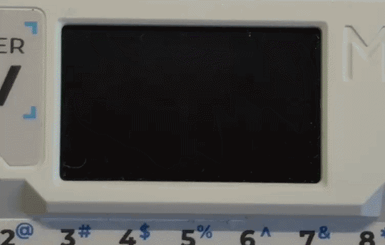
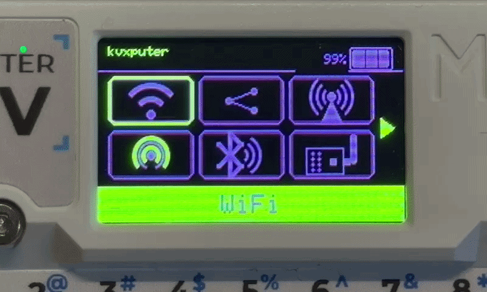
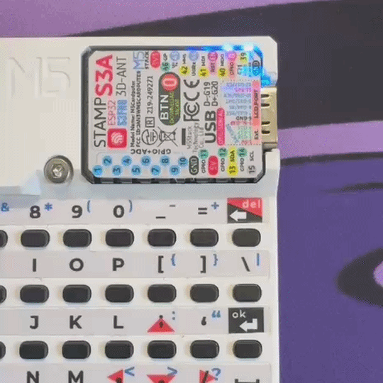

# kvxputer — a firmware focused on flexibility



**kvxputer** is a firmware for the M5Stack **Cardputer** and **Cardputer ADV** that turns the device into a pocket toolkit for wireless research, network analysis, and hardware experimentation. It ships a Wii-style channel menu, a broad set of radio and network tools (WiFi, BLE, Sub-GHz RF, NRF24, Infrared, RFID/NFC, GPS, FM, LoRa), USB/BLE HID and BadUSB support, and a Grove-based module system for optional hardware add-ons. Beyond the tools, it is built to be customized on-device: remappable shortcuts, SD themes (menu art, colors, boot animation), RGB LED effects, brightness and UI options, and a configurable startup app. A secondary PlatformIO environment also builds for **M5StickS3**, with a reduced, button-only feature set.

The project began by borrowing ideas from [Bruce](https://github.com/BruceDevices/Firmware) and [Evil-Cardputer](https://github.com/7h30th3r0n3/Evil-M5project), but its architecture, UI, module layout, and feature set have since diverged into their own thing.

**Use responsibly:** only on networks and devices you own or have explicit permission to test.


---

## Highlights

- **Channel menu** — Wii-style 2×3 grid with purple/green theme
- **Wireless toolkit** — WiFi, BLE, Sub-GHz RF, NRF24, Infrared, RFID/NFC, GPS, FM, LoRa
- **Customization** — shortcuts, SD themes, RGB LED, UI colors/brightness, startup app (**Config**)
- **NetOps** — scanning, rogue DHCP/DNS, NTLM, WPAD, SIP, CCTV, SSH, tunnels, and related lab tools
- **HID & BadUSB** — USB/Bluetooth HID via [kvxkeyboard](docs/HID_REMOTE.md)
- **Universal remote** — learn/replay Flipper-style `.ir` profiles with [kremote](docs/KREMOTE.md)
- **Grove ecosystem** — Scroll, Joystick, PaHub, RFID, RF, IR, GPS, and more on PORT.A
- **Lite / StickS3 builds** — smaller flash or button-only navigation when needed




---

## Getting started

### Requirements

- [PlatformIO](https://platformio.org/) (`pio` on PATH)
- M5Stack Cardputer or Cardputer ADV (primary), or M5StickS3 (secondary)
- USB data cable
- Linux: membership in `uucp` / `dialout` for serial upload

### Build

```bash
cd /path/to/kvxputer
pio run -e m5stack-cardputer
```

Lite (fewer features, smaller image):

```bash
pio run -e m5stack-cardputer-lite
```

M5StickS3:

```bash
pio run -e m5stack-sticks3
```

Merged flash images land at the project root:

```text
kvxputer-m5stack-cardputer.bin
kvxputer-m5stack-sticks3.bin
```

Prefer those at offset `0x0`. Raw app image: `.pio/build/<env>/firmware.bin` at `0x10000`.

Optional LittleFS factory seed:

```bash
pio run -e m5stack-cardputer -t uploadfs
```

### Flash

```bash
pio run -e m5stack-cardputer -t upload
# or
pio device list
pio run -e m5stack-cardputer -t upload --upload-port /dev/ttyACM0
```

StickS3:

```bash
pio run -e m5stack-sticks3 -t upload
```

esptool:

```bash
pio pkg exec -p tool-esptoolpy -- esptool --chip esp32s3 \
  --port /dev/ttyACM0 write_flash 0x0 kvxputer-m5stack-cardputer.bin
```

If upload fails, hold the shoulder button (GPIO0) while plugging USB, then retry.

```bash
pio device monitor -e m5stack-cardputer
```

### SD card

Copy the **contents** of [`tools/sd_pack/`](tools/sd_pack/README.md) to the microSD **root** so the card has `/support_files/`, `/root/themes/`, `/menu/scripts/`. Firmware checks SD first, then LittleFS.

```text
/support_files/
  companions/          companion *.bin
  wifi/                portals, wordlists, deaddrop, probes, …
  netops/              ciw, cctv, crawler, printer, responder
  infrared/profiles/   Flipper-style .ir library
  infrared/esl/        ESL bitmaps
  ble/  rfid/  media/
/root/themes/
/menu/scripts/         BadUSB / interpreter samples
```

| Source | Goes where |
|--------|------------|
| `tools/sd_pack/` contents | SD card root |
| Companion `.bin` | SD → `/support_files/companions/` |
| `tools/build/data/support_files/` | LittleFS via `uploadfs` |
| `kvxputer-*.bin` | Flash over USB |

Details: [SD pack](tools/sd_pack/README.md), [Reference / storage](docs/REFERENCE.md).

---

## Using the device

### Main menu

The home screen is a **2×3 channel grid**. The green footer shows the selected app.

| Key | Action |
|-----|--------|
| `;` / `,` | Move up / left |
| `.` / `/` | Move down / right |
| Enter | Open selected app |
| `` ` `` / Backspace | Back |
| Unit Scroll | Rotate = select, press = open |

Tiles map to WiFi, Discovery, NetOps, BLE, RF, Infrared, RFID, Files, and the other apps below. Some appear only when the hardware or build flag is present (LoRa Cap, FM Si4713, Ethernet, `EVIL_EXTENSIONS`, non-lite).

### G0 (shoulder button)

On Cardputer / Adv, the side **G0** button (GPIO0 — same as the download/boot button) is a global shortcut. Behavior depends on **tap** vs **hold**:

| Action | What happens |
|--------|----------------|
| **Tap** (release before ~700 ms) | **Fake-off** — blanks the display and turns the status LED off. The device stays awake; Wi‑Fi/BLE/apps keep running. Tap **G0** again to wake the screen (restores brightness). In **Charge**, tap also blanks via the charge sleep path and wakes the same way. |
| **Hold** (≥ 700 ms) | **Force home** — escapes the current app/submenu and returns to the main channel grid (fires once per hold; keep holding does not spam). If the screen was fake-off, it wakes first. |

Notes:

- Fake-off is not deep sleep. For full sleep use **Config → Power → Deep Sleep**.
- G0 is also used for flashing: hold G0 while plugging USB if upload fails (bootloader mode).
- StickS3 does not use this Cardputer G0 fake-off / force-home path; see [M5StickS3](#m5sticks3) for its tap/hold button map.

---

## Modules & Add-ons

Hardware plugs into Grove **PORT.A** unless noted. On Cardputer / Adv, PORT.A is **SDA=G2**, **SCL=G1**, plus 5V and GND. Do **not** use Adv system I2C (G8/G9 — keyboard bus) for Grove modules.

On-device setup lives under **Modules**. Domain-specific pin/module picks live under each app's **Config** (RFID Module, RF Module, IR pins, GPS baud, …).

**Conflict rule:** do not share PORT.A between a Grove CC1101/SPI RF stack and PaHub/I2C RFID at the same time.

### Quick map

| Add-on | Interface | Serves | Setup |
|--------|-----------|--------|-------|
| [Unit Scroll](https://docs.m5stack.com/en/unit/UNIT-Scroll) | I2C `0x40` | Global navigation | **Modules → Unit Scroll** |
| [Unit Joystick2](https://docs.m5stack.com/en/unit/Unit%20Joystick2) | I2C `0x63` | Global navigation | **Modules → Unit Joystick** |
| [Unit PaHub v2.1](https://docs.m5stack.com/en/unit/Unit-PaHub%20v2.1) | I2C mux `0x70`–`0x77` | Multiplexes Grove units | **Modules → PaHub** |
| [Unit RFID2](https://docs.m5stack.com/en/unit/rfid2) | I2C `0x28` | **RFID** read/write/clone | **RFID → Config → Module** |
| PN532 (Elechouse / ITEAD) | I2C or SPI | **RFID** + NDEF emulate | **RFID → Config → Module** + Wiring help |
| RC522 | SPI | **RFID** read/write | **RFID → Config → Module** |
| ST25R3916 | SPI or I2C | **RFID** + emulate | **RFID → Config → Module** |
| M5 RF433T / RF433R | Grove GPIO | **RF** TX/RX (simple) | **RF → Config** |
| CC1101 | SPI (+ GDO on Grove) | **RF** full toolkit | **RF → Config → RF Module** |
| NRF24L01(+) | SPI (+ CE on Grove) | **NRF24** | Auto / pin config on some boards |
| M5 IR Mod / Grove IR | Grove GPIO | **Infrared** | **Infrared → Config** |
| GPS module | UART on Grove | **GPS** wardriving / tracker | **GPS → Config** |
| Adafruit Si4713 | I2C | **FM** broadcast | Board flag `FM_SI4713` |
| W5500 Ethernet | SPI | **Ethernet** | SPI CS shared with Grove SPI stack |
| Cardputer Adv LoRa Cap | Onboard SX1262 | **LoRa** chat | Present when `HAS_LORA_CAP` |
| Mic (SPM1423 / INMP441) | Onboard / board pins | **Tools → Microphone** | Board mic flags |
| Chameleon Ultra | BLE | **RFID → Chameleon** | Power on companion, then open app |
| Amiibolink | BLE | **RFID → Amiibolink** | Power on companion, then open app |
| PN532 BLE / PN532Killer | BLE or UART | **RFID → PN532 BLE / UART** | Pair / wire UART |
| Companion ESP sketches | Separate MCU | CSI Radar, FindMy, ChatMesh, C5 Serial | Flash from PC; bins on SD |

### Input: Unit Scroll

Rotary encoder + press for menu navigation.

1. Plug into PORT.A (or a PaHub channel assigned to Scroll).
2. Boot probes `0x40`; if missing, keyboard-only continues.
3. **Modules → Unit Scroll** — status, reconnect, invert direction, test screen.
4. Rotate to move selection; press to open / confirm.

### Input: Unit Joystick2

Analog stick for navigation on supported builds (`UNIT_JOYSTICK2`).

1. Plug into PORT.A or a PaHub channel.
2. **Modules → Unit Joystick** — status / reconnect.

### Hub: Unit PaHub v2.1

PCA9548A mux that splits one PORT.A into **six** Grove channels. Off by default.

1. Plug PaHub into PORT.A. Set DIP address (`0x70`–`0x77`, default `0x70`).
2. **Modules → PaHub** — enable, set or auto-detect address, assign channels, scan.
3. Supported channel assignments: **RFID2**, **NFC (PN532 I2C)**, **Unit Scroll**, **Joystick2**, **RF433R**.
4. When RFID2/NFC channels are assigned, **RFID → Config → Module** can select **M5 RFID2 (chN)** / **M5 NFC (chN)**.

### RFID / NFC readers

Select the active reader under **RFID → Config → RFID Module**. On-device pinouts: **RFID → Config → Wiring help**.

| Module | Chip | Choice | Emulate | Apps |
|--------|------|--------|---------|------|
| M5 Unit RFID2 | WS1850S | M5 RFID2 | No | Read, Scan, Load, Erase, Write NDEF, clone workflows |
| Elechouse PN532 V3 / ITEAD PN532 | PN532 | PN532 on I2C or SPI | Yes (NDEF / T4T limits) | Full Tag-O-Matic + Emulate |
| RC522 | MFRC522 | RC522 on SPI | No | Read / write / clone |
| ST25R3916 | ST25R3916 | ST25R SPI/I2C | Yes | Read / write / emulate (non-lite) |

**PN532 I2C on Cardputer Adv (recommended)**

| PN532 | Cardputer Adv | Grove |
|-------|---------------|-------|
| VCC | 5V | red |
| GND | GND | black |
| SDA | G2 | yellow |
| SCL | G1 | white |

| Board | Switches | Module |
|-------|----------|--------|
| Elechouse V3 | CH1 ON, CH2 OFF | PN532 on I2C |
| ITEAD / Katranji | SET0 H, SET1 L | PN532 on I2C |

**PN532 SPI (advanced):** shared SPI with SD; CS on G1 (`GROVE_SCL`). Do not run I2C RFID on PORT.A at the same time. Then **RFID Module → PN532 on SPI**.

**Typical workflow:** Module → Read tag → Save `.rfid` under `support_files/rfid/` → Emulate (PN532/ST25 only).

### Sub-GHz RF: RF433 and CC1101

| Module | How | Apps |
|--------|-----|------|
| M5 RF433T / RF433R | Single-wire Grove TX/RX | **RF** scan/copy, basic send |
| CC1101 | SPI bus + GDO0 (often Grove SDA); CS on shared SPI | **RF** spectrum, RAW record, Sub-GHz presets, jammer, bruteforce, waterfall |

1. Wire the module (CC1101 commonly via microSD SPI sniffer + Grove GDO).
2. **RF → Config** — RF Module, frequency, TX/RX pins.
3. Open **RF** tools (Scan/copy, Spectrum, Record RAW, …).

PaHub can host **RF433R** on a channel; do not combine that with a CC1101 occupying the same PORT.A SPI/Grove wiring.

### NRF24

NRF24L01(+) on the shared SPI stack (CE often on Grove SDA, CS on SPI SS).

| Serves | Apps |
|--------|------|
| **NRF24** | Information, Spectrum, MouseJack, NRF Jammer |

Some boards expose **NRF24 → Config pins** (legacy vs shared SPI).

### Infrared

| Module | How | Apps |
|--------|-----|------|
| Built-in IR LED | Board TX pin | kremote, TV-B-Gone, Custom IR, IR Read, jammer |
| M5 IR Mod / Grove IR | Grove SDA/SCL as TX/RX | Same apps; pick pins under **Infrared → Config** |

StickS3 enables EXT 5V while the Infrared menu is open for Grove IR power.

### GPS

UART GPS on Grove (TX/RX selectable under **GPS → Config**).

| Serves | Apps |
|--------|------|
| **GPS** | Wardriving (WiFi / BLE / both), GPS Tracker, Wardriving Master *(ext)* |

Set baud rate to match the module (common: 9600 / 115200).

### FM (Si4713)

Adafruit Si4713 FM transmitter when the board build defines `FM_SI4713` (Cardputer does).

| Serves | Apps |
|--------|------|
| **FM** | Broadcast live/reserved, stop, FM spectrum, Hijack TA |

### Ethernet (W5500)

SPI Ethernet module on the shared SPI CS line.

| Serves | Apps |
|--------|------|
| **Ethernet** | Scan Hosts, DHCP Starvation, MAC Flooding |

### LoRa Cap (Cardputer Adv)

Bundled SX1262 LoRa when `HAS_LORA_CAP` is set.

| Serves | Apps |
|--------|------|
| **LoRa** | Chat, settings, username, frequency |

GPS Config can also expose LoRa Cap options on Adv.

### Microphone

Onboard SPM1423 (Cardputer) or INMP441 on boards that define the mic pins.

| Serves | Apps |
|--------|------|
| **Tools → Microphone** | Spectrum, Record (WAV to `support_files/media/`) |

### Wireless RFID companions

No Grove required — BLE/UART companions:

| Device | Open | Role |
|--------|------|------|
| Chameleon Ultra | **RFID → Chameleon** | Dump / emulate via Chameleon BLE |
| Amiibolink | **RFID → Amiibolink** | Amiibo upload / UID modes |
| PN532 over BLE | **RFID → PN532 BLE** | HF/LF tools without wiring PORT.A |
| PN532Killer (UART) | **RFID → PN532 UART** | UART-attached PN532Killer |

### Companion ESP firmwares

Separate sketches in [`tools/companions/`](tools/companions/README.md). **Not** part of Cardputer flash. Build/upload from a PC, copy `.bin` to SD `/support_files/companions/`, list under **Modules → Companion bins**.

| Env | Hardware | Serves |
|-----|----------|--------|
| `companion-csi-beacon` | ESP32-S3 | **WiFi → CSI Radar** |
| `companion-findmy` | ESP32-S3 | **BLE → FindMyEvil** |
| `companion-chatmesh-relay` | ESP32 | **NetOps → EvilChatMesh** |
| `companion-c5-unified` | ESP32-C5 | **WiFi → ESP32C5 Serial** |

```bash
pio run -e companion-csi-beacon
pio run -e companion-c5-unified -t upload
```

---

## Menus & tools

**(ext)** = needs `-DEVIL_EXTENSIONS=1` (on for Cardputer full, off for lite).
**(lite off)** = missing from `m5stack-cardputer-lite`.

### WiFi

| Tool | Purpose |
|------|---------|
| **Connect to Wifi** | Join an AP as STA. |
| **Start WiFi AP** | SoftAP for portals and labs. |
| **Turn Off WiFi** | Tear down STA/AP. |
| **AP info** | Connected-network details (STA). |
| **Wifi Atks** | Target AP, Karma, Beacon SPAM, Deauth Flood, Enhanced Deauth. Target mode: Information, Deauth, Handshake capture, Clone Portal, Deauth+Clone (± verify). |
| **Evil Portal** | Captive portal from SD/LittleFS HTML; logs credentials. |
| **NetCut** | Disrupt/select clients on the local segment. |
| **Listen TCP / Client TCP** *(lite off)* | Raw TCP listen or outbound client. |
| **SOCKS4 Proxy** *(lite off)* | SOCKS4 proxy (default port 1080). |
| **TelNET / SSH** *(lite off)* | Telnet / SSH clients. |
| **Sniffer** *(lite off)* | 802.11 capture / PCAP-style dumps. |
| **Channel Analyzer** *(lite off)* | Channel occupancy view. |
| **Jam Detect** *(lite off)* | Heuristic jamming / noise detection. |
| **Scan Hosts** *(lite off)* | ARP host discovery on the Wi‑Fi LAN. |
| **Wireguard** *(lite off)* | WireGuard tunnel. |
| **Responder** *(lite off)* | LLMNR/NBT-NS style responder for hash labs. |
| **Kvxgotchi** *(lite off)* | Pwnagotchi-inspired grid companion UI. |
| **WiFi Pass Recovery** *(lite off)* | Offline helpers against captured material. |
| **Probes** *(ext)* | Probe SSID lists / spear content. |
| **Handshakes** *(ext)* | Handshake Master — collect/manage PCAPs. |
| **Wall Of Flipper** *(ext)* | Flipper-oriented Wi‑Fi wall. |
| **WiFi Dead Drop** *(ext)* | Covert file drop (`wifi/deaddrop/`). |
| **Open Wifi Checker** *(ext)* | Find open / weak networks. |
| **Aircrack** *(ext)* | On-device helpers against stored captures. |
| **CSI Radar** *(ext)* | CSI sensing (pair with CSI companion). |
| **ESP32C5 Serial** *(ext)* | Dual-radio link to ESP32-C5 companion. |
| **Config** | MAC, AP creds, hidden SSID scan, etc. |

See [WiFi / raw frames](docs/WIFI_P0_AND_RAW_FRAMES.md).

### Discovery

Shortcuts to tools tagged as discovery in the app catalog (sniffer, analyzers, wardriving, Wall of Flipper/Airtag, CSI Radar, UPnP, CCTV, …). Same code as the home menus — Discovery is quick access only.

### NetOps

| Tool | Purpose |
|------|---------|
| **SSH** *(lite off)* | SSH client. |
| **Scan Hosts** *(lite off)* | ARP discovery. |
| **Listen TCP / Client TCP** *(lite off)* | Raw TCP. |
| **Responder** *(lite off)* | Name-service poisoning / hash collection. |
| **Reverse Shell** *(lite off)* | Reverse shell / web-shell helper. |
| **Web Crawler** *(ext)* | HTTP crawl with SD wordlists. |
| **Reverse TCP Tunnel** *(ext)* | Reverse tunnel for a local service. |
| **DHCP Starvation** *(ext)* | Exhaust DHCP pools. |
| **Rogue DHCP** *(ext)* | Rogue DHCP (STA/AP variants). |
| **Switch DNS** *(ext)* | DNS redirect for MITM/portal labs. |
| **Network Hijacking** *(ext)* | Gateway/route hijack helpers. |
| **WPAD Abuse** *(ext)* | WPAD / proxy autodiscovery abuse. |
| **NTLMv2** *(ext)* | Crack/clean NTLMv2 hashes. |
| **UART Shell** *(ext)* | Serial shell bridge. |
| **Printer Tools** *(ext)* | Network printer discovery/abuse. |
| **HoneyPot** *(ext)* | Lightweight honeypot listeners. |
| **EvilChatMesh** *(ext)* | Mesh chat (optional relay companion). |
| **SIP Toolkit** *(ext)* | VoIP/SIP lab tools. |
| **CCTV Toolkit** *(ext)* | CCTV stream / credential helpers. |
| **SSDP Poisoner** *(ext)* | SSDP/UPnP discovery poisoning. |
| **SkyJack** *(ext)* | Wi‑Fi drone control experiments. |
| **UPnP Tools** *(ext)* | UPnP/IGD enumeration. |
| **LDAP Dump** *(ext)* | LDAP enumeration. |
| **Autodiscover Abuse** *(ext)* | Exchange Autodiscover lab. |
| **CIW Zeroclick** *(ext)* | CIW helpers (assets on SD). |
| **EAP Identity Sniff** *(ext)* | Capture EAP Identity on Wi‑Fi. |

### BLE

| Tool | Purpose |
|------|---------|
| **kvxkeyboard HID** *(lite off)* | Bluetooth HID remote (keyboard, media, mouse, presenter, jiggler, PTT). [Docs](docs/HID_REMOTE.md). |
| **Media / Keyboard / Presenter (legacy)** *(lite off)* | Older single-purpose HID entry points. |
| **BLE Scan** *(lite off)* | Scan advertisers. |
| **iBeacon** *(lite off)* | Advertise as iBeacon. |
| **Bad BLE** *(lite off)* | DuckyScript over BLE. [Docs](docs/HID_BADUSB.md). |
| **BLE Spam** | Spoofed/noisy BLE advertisements. |
| **BLE Suite** *(lite off)* | Multi-tool BLE utilities. |
| **Ninebot** *(lite off)* | Scooter BLE experiments. |
| **BLE Sniffer** *(lite only)* | Lite-build sniffer. |
| **BLE Name Flood** *(ext)* | Flood name advertisements. |
| **Wall Of Airtag** *(ext)* | AirTag / Find My wall. |
| **FindMyEvil** *(ext)* | Find My experiments (keys on SD; optional companion). |
| **Skimmer Detector** *(ext)* | Suspicious BLE skimmer heuristics. |

### RF (Sub-GHz)

Needs RF433 and/or CC1101 — see [Modules & Add-ons](#modules--add-ons).

| Tool | Purpose |
|------|---------|
| **Scan/copy** | Capture and replay remotes. |
| **Record RAW** *(lite off)* | Raw Sub-GHz captures. |
| **Custom SubGhz** *(lite off)* | Send presets from storage. |
| **Spectrum** | Live spectrum. |
| **RSSI / SquareWave / Spectogram** *(lite off)* | Alternate visualizations. |
| **Listen** *(lite off)* | Audio listen path when speaker exists. |
| **Bruteforce** *(lite off)* | Protocol brute helpers. |
| **Jammer** *(lite off)* | Continuous TX jammer. |
| **Config** | Module, frequency, pins. |

### NRF24

| Tool | Purpose |
|------|---------|
| **Information** | Probe NRF24 status. |
| **Spectrum** | 2.4 GHz channel view. |
| **MouseJack** *(lite off)* | Research against vulnerable 2.4 GHz HID dongles. |
| **NRF Jammer** | Jam selected channels. |

### Infrared

| Tool | Purpose |
|------|---------|
| **kvxputer universal remote** | **kremote** — learn/save/replay `.ir` profiles. [Docs](docs/KREMOTE.md). |
| **TV-B-Gone** | Common TV power-off blasts. |
| **Custom IR** | Play codes from SD `infrared/profiles/`. |
| **IR Read** | Capture unknown remotes. |
| **IR Jammer** *(lite off)* | Frequency-adjustable jammer. |
| **TagTinker ESL** *(ext)* | Electronic shelf-label tools. |
| **Config** | TX/RX pins and repeats. |

### RFID

Wired readers and companions — see [Modules & Add-ons](#modules--add-ons).

| Tool | Purpose |
|------|---------|
| **Read / Scan / Load / Erase** | Tag-O-Matic dump and file workflows. |
| **Write NDEF / Emulate NDEF** | NDEF write/emulate (PN532/ST25 for emulate). |
| **Chameleon** | Chameleon Ultra companion. |
| **Read EMV** *(lite off)* | EMV reader helpers. |
| **Read 125kHz** *(lite off)* | LF RFID125 path. |
| **Amiibolink** *(lite off)* | Amiibo BLE companion. |
| **PN532 BLE / UART** *(lite off)* | Wireless/UART PN532 paths. |
| **Config** | Module selection and wiring help. |

### GPS

| Tool | Purpose |
|------|---------|
| **Wardriving** | Log WiFi and/or BLE with GPS to CSV. |
| **Wardriving Master** *(ext)* | Multi-device collector mode. |
| **GPS Tracker** *(lite off)* | Tracks / simple map HTML. |
| **Config** | Baud rate and UART pins. |

### USB

| Tool | Purpose |
|------|---------|
| **kvxkeyboard HID** *(lite off)* | USB HID remote. |
| **BadUSB** *(lite off)* | DuckyScript over USB. |
| **USB Keyboard / Clicker (legacy)** *(lite off)* | Older HID helpers. |
| **USB U2F** *(when USB_as_HID)* | U2F gadget experiments. |
| **Mass Storage** *(OTG)* | Expose SD/FS as USB disk. |

### Files

| Tool | Purpose |
|------|---------|
| **SD Card / LittleFS** | Browse and manage files. |
| **WebUI** | HTTP file manager over Wi‑Fi. |
| **Connect** *(lite off)* | Peer file/command sharing over serial. |
| **Mass Storage** | Same MSC expose as USB. |

### Scripts *(lite off)*

Run `.bjs` scripts from `/menu/scripts/` (SD preferred). **Load…** to browse. Can be set as startup app under Config.

### Tools

| Tool | Purpose |
|------|---------|
| **Calculator** | Scientific calculator: `+ - * / ^ %`, trig/logs, `pi`/`e`/`ans`, DEG/RAD, Fn function picker; `*` multiplies, `x` solves linear equations (`2x=4`). |
| **Media Player** *(speaker)* | Browse audio on SD/`support_files/media/audio` and play via the built-in audio pipeline (MP3/WAV/FLAC/AAC/OPUS/MOD/RTTTL). |
| **PDA** *(lite off)* | Pocket Device Assistant with a Wii-style channel hub: Notes, Memos, To-Do, Calendar, Contacts, Alarms, World Clock, and Calculator. Data lives under `support_files/pda/`. Cardputer uses a physical-keyboard caret editor; boards without a keyboard keep the on-screen pad. Calendar: `[]` / Fn+←→ month, Fn+↑↓ year, arrows day. Settings (timezone, shortcuts, LED, …) mirror to SD `/kvxputer/userSettings.json` when an SD card is mounted. |
| **QRCodes** | Built-in and custom QR codes. Defaults lead with [https://github.com/kvx17/kvxputer](https://github.com/kvx17/kvxputer), then softAP Wi‑Fi and Rickroll. |
| **Microphone** | Spectrum and WAV record. |
| **iButton** *(lite off)* | 1-Wire iButton read/write. |
| **LLM Chat** *(ext)* | Stream chat to a configured LLM endpoint. |

### Clock / Charge

| Tool | Purpose |
|------|---------|
| **Clock** | Full-screen clock; submenu opens Timer. |
| **Charge** | Charge-friendly UI with restrained input. |

### Config

| Section | Purpose |
|---------|---------|
| **Display & UI** | Brightness, dim, orientation, colors, theme, shortcuts. |
| **LED Config** | RGB color / effect / brightness. |
| **Audio Config** *(lite off)* | Beeps / speaker options. |
| **System Config** | Clock/NTP, language, network creds, startup app, sleep. |
| **Power** | Sleep and power helpers. |
| **Install App Store** *(lite off)* | Seed JS app-store script if missing. |
| **Dev Mode** | Extra developer toggles. |
| **About** | Device / build info. |



*RGB LED*

### Board-gated menus

| Menu | Needs | Tools |
|------|-------|-------|
| **LoRa** | LoRa Cap / board LoRa | Chat, settings, username, frequency |
| **FM** | Si4713 | Broadcast, spectrum, Hijack TA |
| **Ethernet** | W5500 | Scan hosts, DHCP starvation, MAC flood |

---

## M5StickS3

Same `src/` tree; board HAL under `tools/porting/boards/m5stack-sticks3/`.

| | Cardputer | StickS3 |
|---|-----------|---------|
| Input | Full keyboard (+ optional Unit Scroll) | Side: tap = next, hold = previous. Main: tap = OK, hold = back |
| USB / BLE HID | Yes | Yes (button / on-screen entry) |
| IR | TX + Grove | TX/RX onboard; EXT 5V in Infrared menu |
| Artifact | `kvxputer-m5stack-cardputer.bin` | `kvxputer-m5stack-sticks3.bin` |

Cardputer Adv extras (TCA8418 path, LoRa Cap, Scroll/PaHub defaults) stay off on StickS3.

---

## Project layout

| Path | Purpose |
|------|---------|
| `src/root/` | Core: UI, config, HAL, storage, net |
| `src/menu/<domain>/` | One folder per main-menu app |
| `tools/build/data/` | LittleFS factory seed |
| `tools/build/embedded_resources/` | Assets compiled into firmware |
| `platformio.ini`, `tools/porting/boards/`, `lib/` | Build and board porting |
| `docs/` | Architecture, feature maps, HID/IR guides |
| `tools/sd_pack/` | Copy-to-SD assets |
| `tools/companions/` | Extra-ESP companion sketches |
| `resources/` | Gitignored local reference only |

---

## Docs

- [Architecture](docs/ARCHITECTURE.md)
- [Feature map](docs/EVIL_FEATURE_MAP.md)
- [Reference / storage](docs/REFERENCE.md)
- [SD pack](tools/sd_pack/README.md)
- [Companion firmware](tools/companions/README.md)
- [WiFi / raw frames](docs/WIFI_P0_AND_RAW_FRAMES.md)
- [kvxkeyboard HID](docs/HID_REMOTE.md)
- [HID / BadUSB](docs/HID_BADUSB.md)
- [kremote IR](docs/KREMOTE.md)
- [QA matrix](docs/QA_MATRIX.md)

---

## License & credits

**AGPL-3.0-or-later.** See [LICENSE](LICENSE) and [NOTICE](NOTICE).

Maintained at [github.com/kvx17/kvxputer](https://github.com/kvx17/kvxputer).

Early ideas came from Bruce (BruceDevices) and Evil-Cardputer (7h30th3r0n3); upstream notices remain where applicable, and the combined distribution is AGPL-3.0 because of the Bruce lineage. The project has since grown into its own codebase and direction.

Use responsibly: only on networks and devices you own or have explicit permission to test.